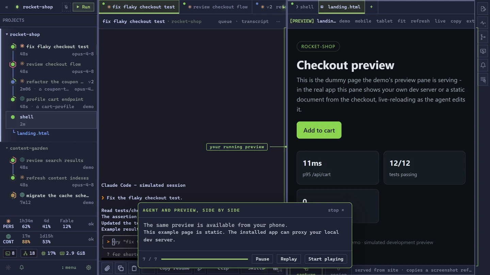

# swe-mux

**Run your coding agents together. Know which ones need you.**

Keep Claude Code, Codex and other coding agents side by side, with live status, flexible panes and messages between sessions.
Work from your desktop or phone.
Dictate prompts, hear replies, and ask the assistant what needs attention.

[](https://swemux.dev/demo/)

[Try the interactive demo](https://swemux.dev/demo/) or [read the setup guide](https://swemux.dev/docs/install/).
The demo runs the real interface with simulated agent activity and needs no provider connection.

## What you can do

- **See which agent needs you.** Live status, searchable alert history, per-event sounds and push notifications, quiet hours and separate Desktop/Mobile profiles.
- **Keep working from your phone.** Terminals, Git review, notes, files, queues and local previews over your own Tailscale connection.
- **Keep familiar input.** Shared editing behavior across supported agent composers, workspace keymaps for tmux, VS Code, Vim and Emacs, and clipboard image paste for image-capable agents.
- **Reuse copied text.** Shared history of text copied inside swe-mux, with optional persistence and pinned entries.
- **Use voice.** Local speech recognition, optional read-aloud, and an assistant that can inspect sessions and propose actions under your chosen trust settings.
- **Let sessions coordinate.** Messages, progress reads and requests for help governed by Project permissions.
- **Finish parallel work.** Reconcile a branch, run approved checks and fast-forward through the land queue; conflicts and failed checks return to the owning agent.
- **Find and inspect earlier work.** Search cross-agent conversations, reopen transcripts, and enable recorded evidence and commit provenance when you need them.

## What runs where

Your agent CLIs run in real terminals under your existing subscriptions.
Data stays on your machine, with no swe-mux account, vendor-operated backend or usage telemetry.
Agent providers, optional integrations and update checks still use the network.
The assistant uses your configured model endpoint and budget; speech recognition running locally is a separate capability.

A separate supervisor keeps sessions working through daemon restarts and app updates.
Supervisor death and power loss end live processes; cold recovery restores readable, resumable records.
Automation and agent control have explicit Project permissions.
Clipboard history records in-app text copies and is memory-only unless persistence is enabled.

## Install

<!-- TODO(release): the installer exists as of v0.1.2 and is NOT code signed. When a signing
     certificate is in hand, say here which Windows builds and architectures it is signed for and
     drop the SmartScreen sentence below. The site does not need that edit:
     https://swemux.dev/#download is drawn from the release manifest. This file is the copy that
     stays manual, so it is the one to remember. -->

swe-mux is on PyPI. The wheel is pure Python and carries the built frontend, so this needs no Node and no checkout.

```
# Recommended. Isolated environment, every command on your PATH globally.
uv tool install swe-mux
swe-mux  # Windows: open the desktop app and tray

# The same isolated, on-PATH install, without uv.
pipx install swe-mux
swe-mux  # Windows: open the desktop app and tray
```

On Windows that is everything: run `swe-mux` and you get the native window and a tray icon, with no console and nothing else to install.
The setup guide offers Start Menu, desktop, and sign-in shortcuts and detects those already configured.
Setup, the UI tour, and optional first steps remain available in Getting started above Usage in the sidebar.

Elsewhere - or if you would rather just use the browser - `swemux start` puts the daemon in the background and returns once it is serving <http://127.0.0.1:8765>; closing the terminal does not stop it, and `swemuxd --shutdown` does.
`swemuxd` still runs it in the foreground when you want the log in front of you.
`swemux doctor` is a read-only health report covering the daemon, the supervisor, the frontend build, detected agent CLIs, the tailnet listener, and background loops.

Every install writes three commands, one per program: **`swemux`** (the CLI), **`swemuxd`** (the daemon), and **`swe-mux`** (the desktop window and tray).
There are no short aliases, deliberately: `mux` is shared with at least one unrelated tool, and shipping a launcher under a contested name is what creates the collision rather than what survives it.

A **Windows installer** is published from v0.1.2 onward, alongside a portable archive, on the [releases page](https://github.com/jatoran/swe-mux/releases).
It is **not code signed**, so SmartScreen warns on first run; the PyPI install avoids that prompt entirely.

**No Python install of any kind creates a desktop shortcut.**
Wheels have no post-install hook, so `uv` prints its own installation summary.
Launch `swe-mux` on Windows or `swemuxd` for the browser UI to begin setup.
`swemux install-shortcut --startup` also creates Start Menu, desktop, and sign-in shortcuts directly.
Use Help → Restart setup or `swemux setup --restart` to choose retained settings or backed-up fresh global preferences.
For isolated first-use testing, `swemuxd --new-user-profile test-one` uses separate data and a separate local port.

Running from a checkout, upgrades, PATH troubleshooting and uninstall: [`.docs/development/OPERATOR_LIFECYCLE.md`](.docs/development/OPERATOR_LIFECYCLE.md).

### Requirements

- Python 3.12+, and uv or pipx to install with.
- At least one agent CLI, already installed and logged in. swe-mux does not install, manage, or proxy them.
- Optionally Tailscale, to reach the daemon from a phone.
- Node 22.6+ **only** to build the frontend from source; the published wheel carries it.

On-device speech is optional and acquired on an explicit press rather than shipped: the libraries and their models are downloaded once, verified against pinned hashes, and nothing is fetched until you ask.
**Speech-to-text decodes on your own machine in both shipped configurations** - faster-whisper, or Windows Speech Recognition. There is no cloud speech path and no browser fallback; without an engine, transcription returns a typed error rather than sending audio anywhere.
Text-to-speech is the same, except the explicitly experimental Edge TTS provider, which does leave the machine and requires an acknowledgement first.

## First run

Create a Project and point it at an existing folder.
`Ctrl+Shift+Enter` opens a terminal at its root, `Ctrl+Shift+P` (or `F1`) opens the command palette; nothing is spawned until you ask.

Then type `claude`, `codex`, or another CLI normally.
swe-mux puts its own launchers first on that terminal's PATH, so the usual command promotes the terminal you are standing in to an agent session in place: same pane, same scrollback, now carrying a transcript, a status, a queue, and a context meter.

The **Run** menu starts an agent, a shell, a worktree session, or an imported task. Imported tasks - VS Code tasks, `package.json` scripts, `.swe-mux/actions.toml` - stay inert until their exact current bytes are trusted. ([project actions](.docs/design/features/project-actions.md))

## Platform support

CI builds, validates and install-smokes the wheel on Windows, Linux and macOS every push, and starts a real daemon on Linux and Windows from the source checkout to prove it serves a shell and exits cleanly.
No CI job starts a daemon from a **published artifact**, which is exactly where the proof stops.

- **Windows 10/11 is the proving platform.** The full gate runs there, including real ConPTY integration and the Playwright renderer suite, and it is the only platform the desktop app ships on.
- **Linux runs headless plus a browser**, on a required CI leg. There is no Linux desktop app, by design.
- **macOS runs the daemon and browser client**, with required CI checks including the source-daemon tier.

What each claim rests on: [`.docs/development/CROSS_PLATFORM_FINDINGS.md`](.docs/development/CROSS_PLATFORM_FINDINGS.md).

## Remote access

The daemon listens on localhost and on the machine's detected Tailscale IPv4 address; `swemuxd --local-only` keeps it local.
**Tailscale policy is the access boundary**, and swe-mux has no separate remote login, so a tailnet peer your policy admits has terminal and code-execution authority.

Browsers restrict the clipboard and microphone over plain HTTP, so for those put Tailscale Serve in front: `tailscale serve --bg http://127.0.0.1:8765`.
`0.0.0.0`, direct LAN binding, Funnel, port forwarding and public ingress are unsupported. ([detail](.docs/design/features/remote-access.md))

## Configuration and data

Configuration is `config.toml` inside the data directory: `~/.mux` on Windows, `$XDG_DATA_HOME/swe-mux` (else `~/.local/share/swe-mux`) on Linux, `~/Library/Application Support/swe-mux` on macOS.
An existing `~/.mux` always wins, and `MUX_DATA_DIR` overrides all of it.

## Provider accounts

Settings → Accounts saves Claude and Codex logins, tracks each account's subscription window, and switches the system-wide login in one click. Only authentication is copied.

This is a convenience for **one person switching between accounts they personally own and pay for**, replacing the logout/login cycle the provider CLIs otherwise require.
It is not account pooling and not a way around a usage limit: accounts are never shared between people, credentials stay local and go nowhere but the provider's own endpoints, sessions are never load-balanced, and switching is always explicit. ([scope and terms](.docs/design/features/provider-accounts.md))

## Documentation

Published docs: <https://swemux.dev/docs/>.
The maintained design contract starts at [`.docs/design/00_OVERVIEW.md`](.docs/design/00_OVERVIEW.md), and [`.docs/CLAUDE.md`](.docs/CLAUDE.md) routes each subsystem to the document that owns it.

## Contributing

Contributions are welcome.
Feature requests are [Discussions in the Ideas category](https://github.com/jatoran/swe-mux/discussions/categories/ideas), where a thumbs-up is a vote and the most-voted open ideas are drawn on the [roadmap](https://swemux.dev/roadmap/); [issues](https://github.com/jatoran/swe-mux/issues) are for bugs.
Describe the problem rather than the fix.
[`CONTRIBUTING.md`](CONTRIBUTING.md) covers what a change has to satisfy; [`CLAUDE.md`](CLAUDE.md) covers the working rules; [`SECURITY.md`](SECURITY.md) is where a vulnerability report goes.

## License

swe-mux is licensed under the [Apache License 2.0](LICENSE).
See [`NOTICE`](NOTICE) for attribution and [`TRADEMARK.md`](TRADEMARK.md) for what the license's trademark reservation does and does not allow.

Contributions arrive under a [DCO sign-off](CONTRIBUTING.md) - `git commit -s` - and not a CLA.
A CLA would let the project relicense your contribution later; a DCO does not, and that is the intended trade.

Third-party software redistributed with swe-mux is listed in [`THIRD-PARTY-NOTICES.md`](THIRD-PARTY-NOTICES.md), generated from the lockfiles by `packaging/license_audit.py` so it cannot drift.
swe-mux ships no GPL or AGPL code; it ships `pystray` under the LGPL as replaceable source inside the bundle.

### Not affiliated with the agent vendors

swe-mux launches and observes coding-agent CLIs published by other vendors, including Anthropic's Claude Code and OpenAI's Codex CLI.
It is **not affiliated with, endorsed by, sponsored by, or certified by** Anthropic, OpenAI, or any other such vendor, and it uses their names only to identify which tool a feature works with.
You run those CLIs under your own account and your own agreement with each vendor, and the same is true of the optional OpenRouter and Hugging Face integrations.

The optional Edge TTS integration is different: the upstream client uses Microsoft Edge's consumer Read Aloud endpoint with no API key and no documented third-party service contract, so selecting it requires an explicit disclosure acknowledgement.
That client is LGPL, runs only in an isolated managed or operator-supplied Python, and is absent from the frozen bundle - but that software boundary does not resolve Microsoft's service terms.
